# Lab 2: Introduction to Linux (with focus on Kali)

**Course:** SPTI
**Authors:** David Velásquez, Jesús Pinzón
**Date:** 2026-02-01

---

## Part 1: Exploring the System

### 1.1 Navigating the File System

**Commands executed:**
```bash
cd /
ls -la
cd /etc
ls -la
cd /var
ls -la
cd /home
ls -la
```

**Purpose of each directory:**

| Directory | Purpose |
|-----------|---------|
| `/etc` | System configuration files (passwd, shadow, network configs, service configs) |
| `/var` | Variable data files (logs, mail, temporary files, databases) |
| `/home` | User home directories containing personal files and settings |

**Screenshot 1.1:** Navigation through /, /etc, /var, /home

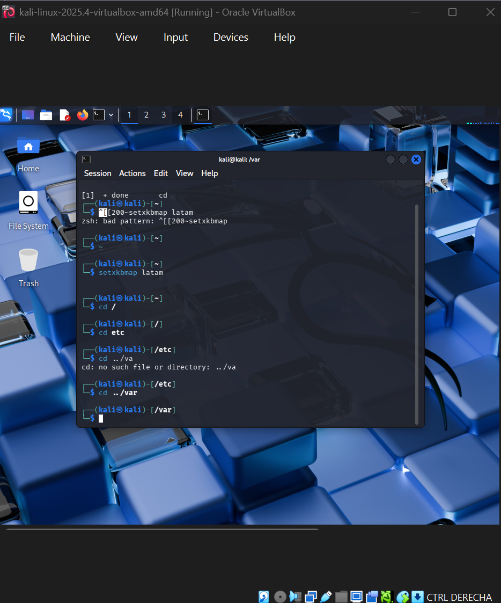
---

### 1.2 Analyzing /etc/passwd

**Command executed:**
```bash
cat /etc/passwd
```

**Screenshot 1.2:** Contents of /etc/passwd

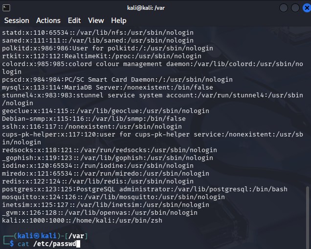
**What type of information does it contain?**

The `/etc/passwd` file contains user account information with the following fields (colon-separated):
1. **Username** - Login name
2. **Password** - 'x' indicates password is in /etc/shadow
3. **UID** - User ID number
4. **GID** - Primary group ID number
5. **GECOS** - User description/full name
6. **Home directory** - Path to user's home
7. **Shell** - Default login shell

Examples:
- `root:x:0:0:root:/root:/bin/bash`
- `kali:x:1000:1000:kali,,,:/home/kali:/usr/bin/zsh`

**Difference between /etc/passwd and /etc/shadow:**

| /etc/passwd | /etc/shadow |
|-------------|-------------|
| Readable by all users | Only readable by root |
| Contains user account info | Contains encrypted passwords |
| Has 'x' placeholder for password | Has actual password hash |
| No password aging info | Contains password aging policies |

---

### 1.3 Permissions of /etc/shadow

**Command executed:**
```bash
ls -l /etc/shadow
```

**Screenshot 1.3:** Permissions of /etc/shadow

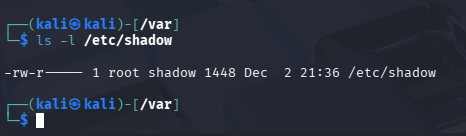

**Why can't it be read as a normal user?**

The `/etc/shadow` file has permissions `-rw-r-----` (640) owned by `root:shadow`. This means:
- **Owner (root):** read and write (`rw-`)
- **Group (shadow):** read only (`r--`)
- **Others:** no permissions (`---`)

The `kali` user cannot read this file because:
- `kali` is not the owner (root)
- `kali` is not a member of the `shadow` group
- Therefore, `kali` falls into "others" which has no permissions

This is a critical security measure because `/etc/shadow` contains the hashed passwords of all system users. If any user could read it, they could:
- Copy the hashes and crack them offline using tools like John the Ripper or Hashcat
- Potentially gain access to other user accounts, including root

---

### 1.4 Reviewing System Logs

**Note:** Modern Kali Linux uses `journald` instead of traditional log files. The files `/var/log/auth.log` and `/var/log/syslog` don't exist by default. We use `journalctl` instead.

**Commands executed:**
```bash
# View authentication/security logs (equivalent to auth.log)
sudo journalctl _COMM=sudo --no-pager | head -30

# View general system logs (equivalent to syslog)
sudo journalctl --no-pager | head -50
```

**Screenshot 1.4a:** Authentication logs with journalctl


**Screenshot 1.4b:** System logs with journalctl

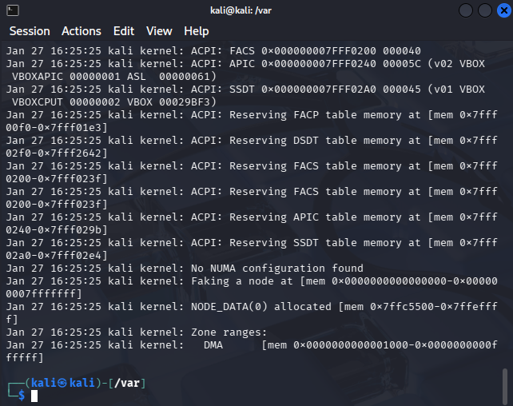

**Pair Discussion: What types of security events can be detected in these logs?**

| Log File | Security Events Detectable |
|----------|---------------------------|
| **auth.log** | Failed login attempts, sudo usage, SSH connections, user authentication failures, privilege escalation attempts, PAM module events |
| **syslog** | Service starts/stops, kernel messages, system errors, network interface changes, firewall events, suspicious process activity |

These logs are critical for:
- Detecting brute-force attacks (multiple failed logins)
- Identifying unauthorized access attempts
- Monitoring privilege escalation
- Forensic analysis after security incidents

---

## Part 2: Files and Permissions

### 2.1 Creating Working Environment

**Commands executed:**
```bash
mkdir ~/linux_practice
cd ~/linux_practice
echo "This is the content of file 1" > file1.txt
echo "This is the content of file 2" > file2.txt
echo "This is the content of file 3" > file3.txt
ls -la
```

**Screenshot 2.1:** Creating folder and files

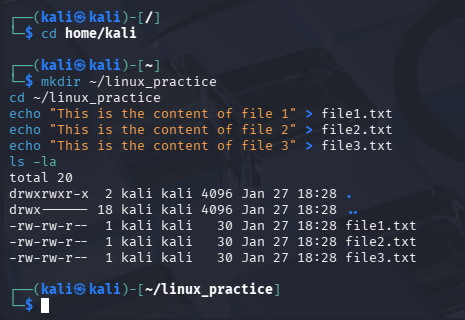

---

### 2.2 File Operations

**Commands and their effects:**

```bash
cp file1.txt copy.txt
```
**Effect:** Creates a duplicate of file1.txt named copy.txt (original remains unchanged)

**Screenshot 2.2a:** cp command result

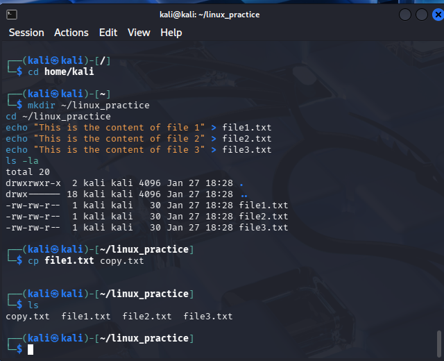

---

```bash
mv file2.txt renamed.txt
```
**Effect:** Renames file2.txt to renamed.txt (original no longer exists)

**Screenshot 2.2b:** mv command result

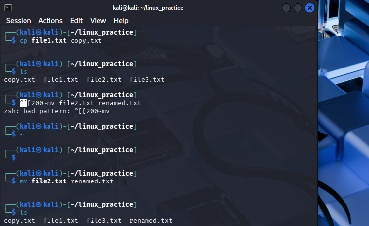

---

```bash
rm file3.txt
```
**Effect:** Permanently deletes file3.txt from the system

**Screenshot 2.2c:** rm command result


---

```bash
chmod 644 copy.txt
ls -l copy.txt
```
**Effect:** Sets permissions to `-rw-r--r--` (owner: read/write, group: read, others: read)

**Screenshot 2.2d:** chmod 644 result

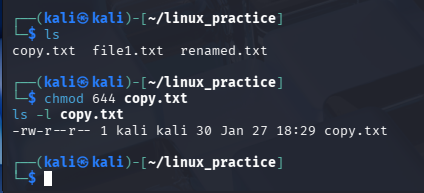

---

```bash
chmod +x renamed.txt
ls -l renamed.txt
```
**Effect:** Adds execute permission for all users (owner, group, others)

**Screenshot 2.2e:** chmod +x result

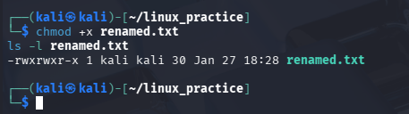

---

```bash
sudo chown root:root copy.txt
ls -l copy.txt
```
**Effect:** Changes file ownership to root user and root group

**Screenshot 2.2f:** chown result

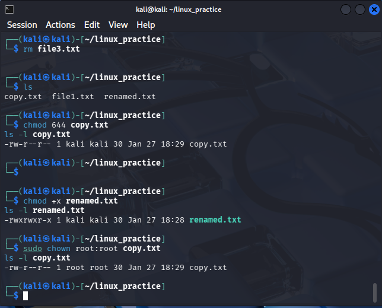

---

### 2.3 Collaborative Activity: Security Problem with chmod/chown

**Scenario: Dangerous misconfiguration of /etc/shadow**

```bash
sudo chmod 777 /etc/shadow
```

**Security Problem Explanation:**

If an administrator accidentally runs `chmod 777 /etc/shadow`:
1. **All users can READ** the password hashes
2. **All users can MODIFY** the file (change any user's password)
3. **Attackers can:**
   - Copy hashes and crack them offline (John the Ripper, Hashcat)
   - Replace root's password hash with their own
   - Delete passwords entirely, enabling passwordless login
   - Add new privileged accounts

**Another example with chown:**
```bash
sudo chown kali:kali /etc/sudoers
```
This would allow the `kali` user to edit the sudoers file and grant themselves unrestricted root privileges without password.

---

## Part 3: Processes and Services

### 3.1 Observing Processes with top

**Command executed:**
```bash
top
```

**Screenshot 3.1a:** top command output

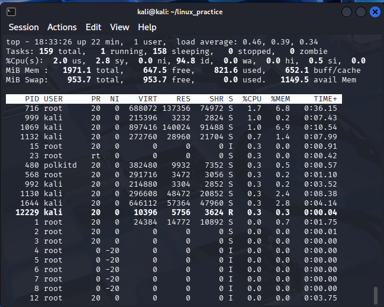

**Filtering with ps:**
```bash
ps aux | grep bash
```

**Screenshot 3.1b:** ps aux filtered for bash

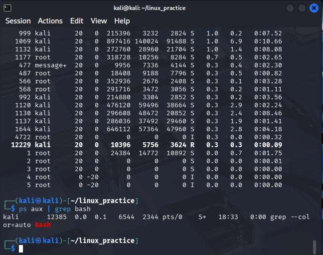

---

### 3.2 Background Process Management

**Commands executed:**
```bash
ping 8.8.8.8 &
ps aux | grep ping
kill [PID]
ps aux | grep ping
```

**Screenshots 3.2:** Starting and killing background process

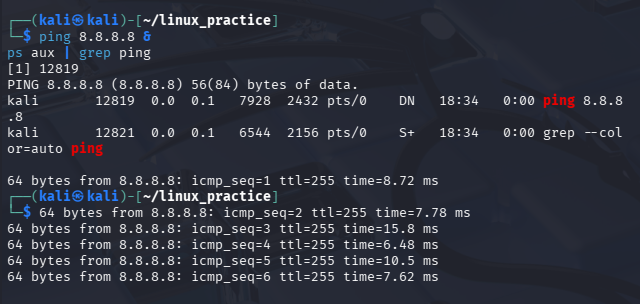
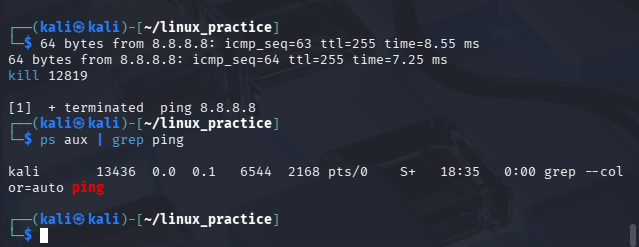
---

### 3.3 Service Status

**Commands executed:**
```bash
systemctl status ssh
systemctl status cron
systemctl status cups
```

**Screenshot 3.3a:** SSH service status

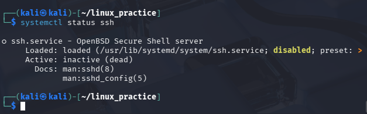

**Screenshot 3.3b:** Cron service status

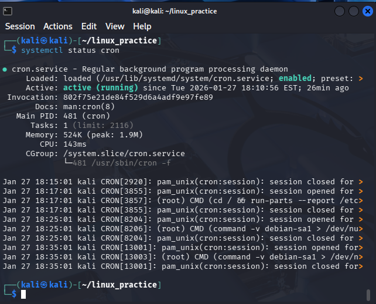

**Screenshot 3.3c:** CUPS service status

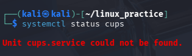

**Reflection: Why should some services be active while others should not?**

| Service | Should be Active? | Reasoning |
|---------|------------------|-----------|
| **SSH** | Only if needed | Remote access service - if not needed, disable to reduce attack surface. If enabled, use key-based auth and fail2ban |
| **Cron** | Usually yes | Task scheduler - needed for system maintenance, log rotation, updates |
| **CUPS** | Usually no | Print service - unnecessary on most security-focused systems, potential attack vector |

**Security Principles:**
- **Principle of Least Functionality:** Disable services not required for the system's purpose
- **Attack Surface Reduction:** Each running service is a potential entry point
- **Resource Conservation:** Unused services consume memory and CPU
- **Audit Compliance:** Many security standards require disabling unnecessary services

---

## Part 4: Package Management

### 4.1 Searching for Packages

**Command executed:**
```bash
apt search nmap
```

**Screenshot 4.1:** apt search results

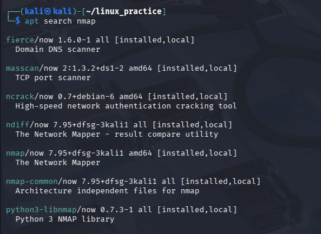

---

### 4.2 Installing and Removing Packages

**Commands executed:**
```bash
sudo apt update
sudo apt install htop -y
which htop
htop --version
sudo apt remove htop -y
which htop
```

**Screenshot 4.2a:** Installing htop

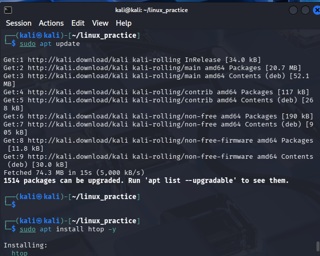

**Screenshot 4.2b:** Verifying and removing htop

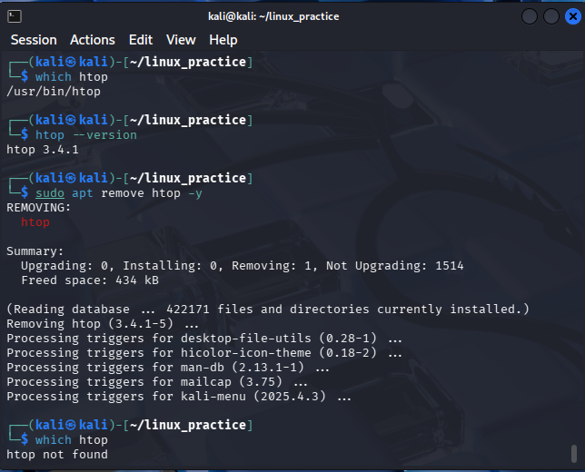

**Discussion: Security risks of installing packages from untrusted sources**

1. **Malware Injection:** Packages may contain backdoors, trojans, or cryptominers
2. **Supply Chain Attacks:** Compromised repositories can distribute malicious updates
3. **Dependency Confusion:** Malicious packages with similar names to legitimate ones
4. **Privilege Escalation:** Installation scripts run as root, can modify system files
5. **Data Exfiltration:** Packages may steal credentials, keys, or sensitive data

**Best Practices:**
- Only use official repositories
- Verify package signatures (GPG)
- Check package checksums
- Review package source when possible
- Use `apt-key` to manage trusted keys
- Avoid adding random PPAs

---

## Part 5: Automation with Bash

### 5.1 Script Description

The script `count_lines.sh` performs the following:
- Finds all `.txt` files in a specified directory (or home by default)
- Counts the lines in each file
- Prints results ordered by line count
- Optionally saves results to a file (second argument)

### 5.2 Script Code

See attached file: `count_lines.sh`

**Screenshot 5.2:** Script content

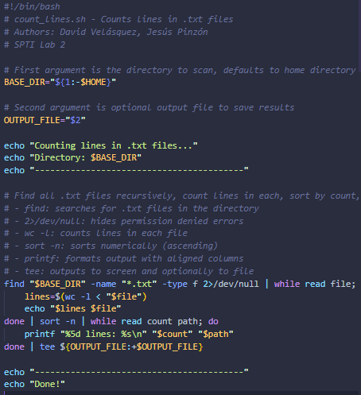

### 5.3 Script Execution

**Commands executed:**
```bash
chmod +x count_lines.sh
./count_lines.sh
./count_lines.sh ~/linux_practice
./count_lines.sh ~/linux_practice results.txt
cat results.txt
```

**Screenshot 5.3a:** Basic execution

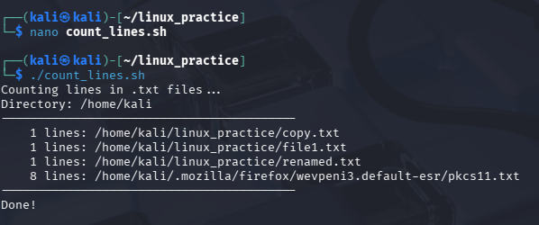

**Screenshot 5.3b:** Execution with custom directory 

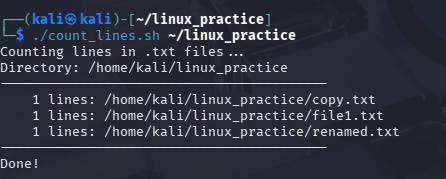

**Screenshot 5.3c:** Execution with custom directory and custom file

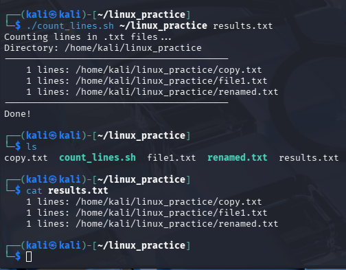

---

## Conclusion

Linux is the foundation of most cybersecurity work. The file system structure (`/etc`, `/var`, `/home`) organizes configuration, logs, and user data in predictable locations that both defenders and attackers need to understand. Files like `/etc/passwd` and `/etc/shadow` demonstrate how Unix permissions protect sensitive data through ownership and access controls.

Process management with `ps`, `top`, and `kill` allows monitoring system activity, while `systemctl` controls which services expose potential attack surfaces. Package managers like `apt` simplify software installation but introduce supply chain risks when using untrusted sources.

Bash scripting automates repetitive tasks, from log analysis to system auditing. These core Linux skills apply directly to penetration testing, incident response, and system hardening.

---

## Files Included

1. `Lab2_Linux_Report.md` - This report
2. `count_lines.sh` - Bash automation script
3. `screenshots/` - All screenshots

---

## 👥 *Authors*

<table>
  <tr>
    <td align="center">
      <a href="https://github.com/JAPV-X2612">
        
        <br />
        <sub><b>Jesús Alfonso Pinzón Vega</b></sub>
      </a>
      <br />
      <sub>Full Stack Developer</sub>
    </td>
    <td align="center">
      <a href="https://github.com/JAPV-X2612">
        
        <br />
        <sub><b>David Felipe Velásquez Contreras</b></sub>
      </a>
      <br />
      <sub>Full Stack Developer</sub>
    </td>
  </tr>
</table>
